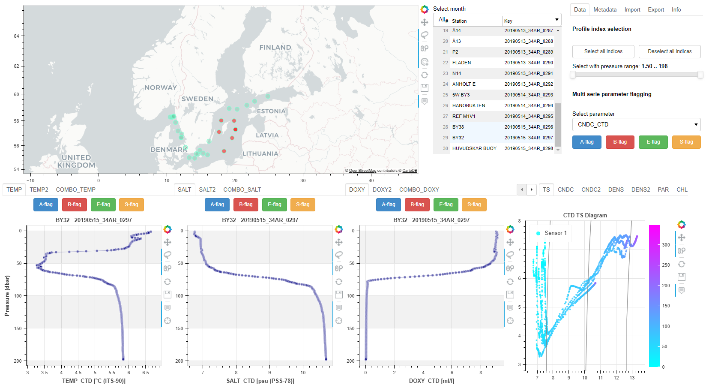
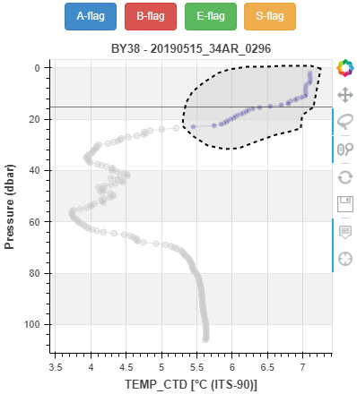

CTDvis
======

[](https://pypi.python.org/pypi/ctdvis/)
[](https://pypi.python.org/pypi/ctdvis/)
[](https://pypi.python.org/pypi/ctdvis/)

Python 3 library developed by Shd at SMHI.

- Visualize high resolution oceanographic profile data, eg. CTD, MVP.
- Main purpose: Quality control


Installation
------------

CTDvis can be installed from PyPI with pip:

```bash
pip install ctdvis
```

Example visualization
--------



 


